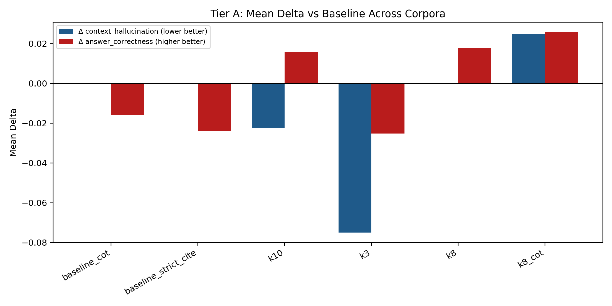
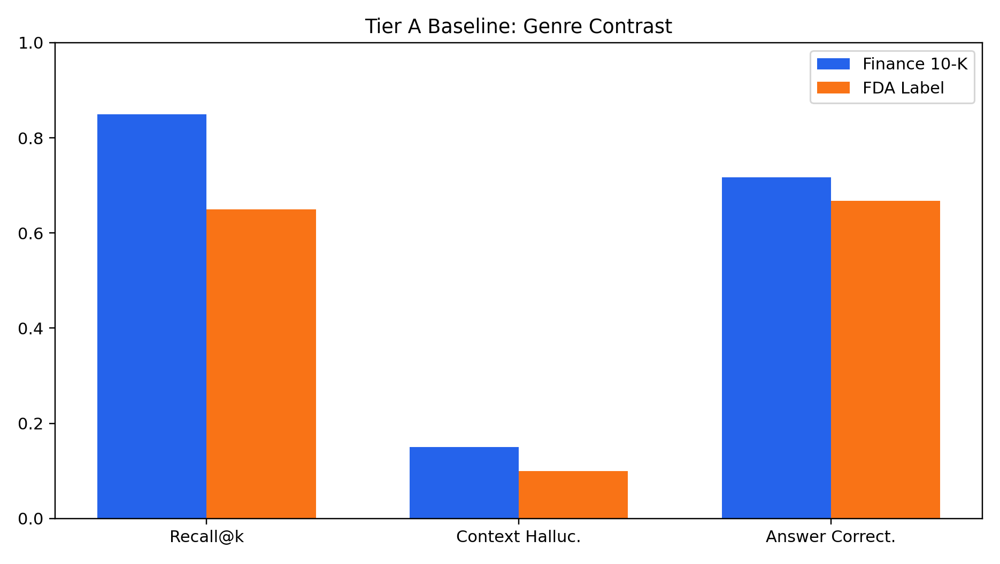
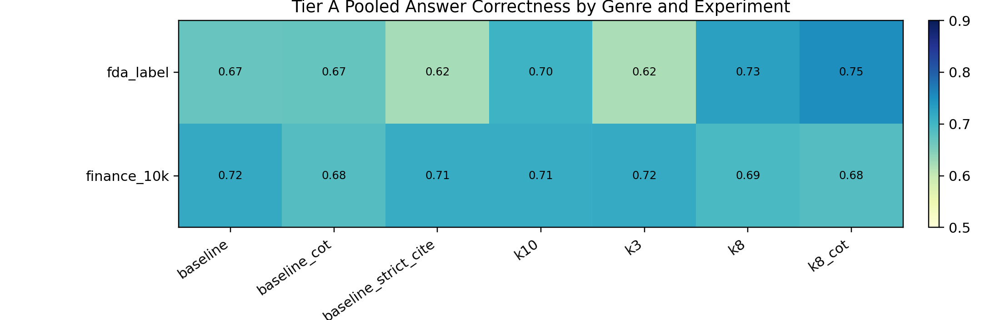
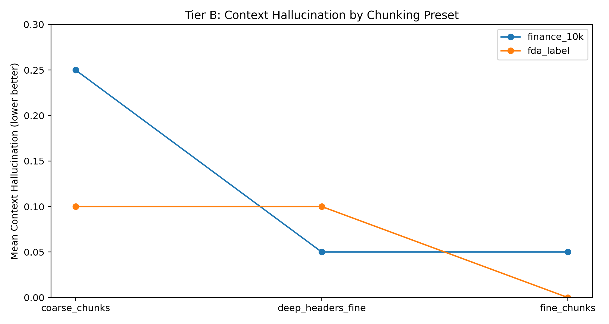
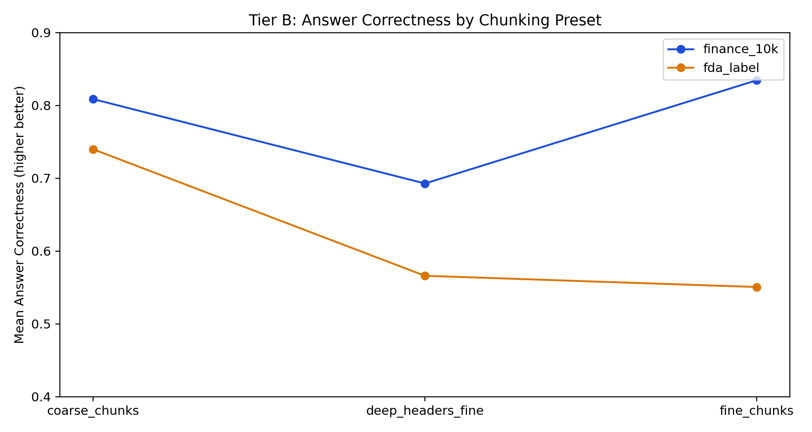
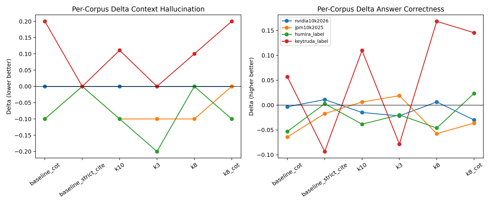

# Retrieval-Augmented Generation Tradeoffs for Hallucination Mitigation in Financial and Biomedical Document Question Answering

**Author:** Trevor Connolly  
**Course:** COS IW  
**Advisor:** Professor Christiane Fellbaum  
**Project Type:** Semester research project (non-thesis)  
**Date:** April 2026

---

## Abstract

Large language model (LLM) systems are increasingly used to answer questions over long, technical documents in finance and healthcare. In these domains, an answer that is fluent but unsupported by evidence can introduce legal, compliance, and operational risk. This project evaluates Retrieval-Augmented Generation (RAG) design choices for reducing hallucination-like failures while preserving answer quality. The implementation includes an end-to-end reproducible pipeline: PDF ingestion and semantic chunking, hybrid retrieval (dense + sparse + reranking), citation-constrained answer generation, synthetic gold dataset creation, and multi-metric evaluation with both rule-based and judge-based metrics.

The study compares 10 experiment presets across four corpora (two SEC 10-K filings and two FDA labels), with 10 evaluated questions per experiment per corpus in this project phase. Tier A experiments preserve baseline chunking and gold labels to support fair delta comparisons against baseline; Tier B experiments vary chunking strategy and regenerate gold labels, so they are interpreted within-tier only. Results show a consistent tradeoff: narrower retrieval (`k=3`) yields the strongest average reduction in context-grounded hallucination flags, while broader retrieval plus chain-of-thought (`k=8 + CoT`) yields the strongest average gain in answer correctness but increases hallucination flags. No single preset dominates all metrics across both document genres. The practical implication is that teams should select target behavior (grounding conservatism vs correctness coverage vs abstention policy) before selecting a RAG preset.

---

## 1. Introduction

### 1.1 Problem Context

RAG has become the default strategy for enterprise LLM deployments on private or domain-specific text because it can constrain answers to retrieved evidence rather than relying only on parametric memory. However, production behavior still depends heavily on system design details: chunking granularity, retrieval depth, reranking, prompting style, and citation enforcement. In high-stakes settings such as investor reporting and drug-label interpretation, these design details can determine whether an answer is trustworthy enough for decision support.

This project addresses a practical question:

> Which concrete RAG design choices reduce hallucination-like behavior on dense professional PDFs while retaining useful answer quality?

### 1.2 Project Goals

The project has five goals:

1. Build a reproducible RAG evaluation pipeline that runs from raw PDF to per-question metrics.
2. Compare multiple design presets under controlled conditions.
3. Quantify tradeoffs among grounding-related and quality-related metrics, rather than optimize a single score.
4. Test whether findings differ by document genre (SEC 10-K vs FDA label).
5. Produce reusable artifacts (logs, tables, figures, scripts, and presentation) suitable for practitioners and future extensions.

### 1.3 Contributions

This report contributes:

- A complete implementation-level description of a multi-stage RAG experiment harness.
- A two-tier experimental protocol separating fair delta comparisons (Tier A) from chunking-ablation exploration (Tier B).
- Cross-corpus and pooled analyses showing consistent metric tradeoffs.
- A practical interpretation framework for choosing presets under domain constraints.

---

## 2. Related Work

This project is informed by three major lines of prior work:

1. **RAG architecture and retrieval quality.** Foundational RAG work established retrieval as a mechanism for grounding generation in external knowledge sources, motivating hybrid retrieval and reranking workflows in domain QA [1], [4].
2. **Hallucination and factuality evaluation.** Recent LLM hallucination studies distinguish unsupported generation from strict task inaccuracy, motivating use of both grounding-oriented and correctness-oriented metrics [5].
3. **LLM-as-judge evaluation frameworks.** Libraries such as RAGAS support faithfulness/relevancy/correctness scoring with standardized evaluation interfaces and have become common in practical RAG benchmarking [6].

In industry, many systems claim reduced hallucination via citations or guardrails, but defaults are often tuned for generic chat rather than long, highly structured documents. This project focuses on controlled variation of implementation knobs that practitioners can actually deploy.

---

## 3. Research Questions and Hypotheses

### 3.1 Research Questions

**RQ1.** How do retrieval depth and prompting style affect context-grounded hallucination and answer correctness?  
**RQ2.** Does strict citation post-processing reduce unsupported behavior without excessive quality loss?  
**RQ3.** Are outcomes consistent across finance and healthcare corpora?  
**RQ4.** How sensitive are outcomes to chunking strategy changes?

### 3.2 Directional Hypotheses

- Smaller `top_k` may reduce unsupported claims by limiting noisy context.
- Larger `top_k` and CoT may improve correctness by increasing evidence coverage, but may introduce extra unsupported synthesis.
- Genre-specific structure (10-K narrative breadth vs FDA labeling structure) may change retrieval difficulty and optimal preset behavior.

---

## 4. System Overview and Pipeline

The implementation orchestrates four major stages: ETL, gold generation, retrieval/generation, and evaluation.

### 4.1 End-to-End Orchestration

`src/run_pipeline.py` is the main orchestrator. It:

1. Loads an experiment preset (`src/experiment_config.py`).
2. Optionally runs ETL (`src/etl_pipeline.py`) with preset chunk parameters.
3. Rebuilds vector index if needed (`src/vector_store.py`).
4. Optionally regenerates synthetic gold Q/A labels (`src/generate_gold_dataset.py`).
5. Runs evaluation (`src/evaluator.py`) and writes per-question result CSVs.

`scripts/run_all_experiments_one_corpus.py` executes all registered experiments on one corpus with environment-variable scoping:

- `RAG_CORPUS_JSONL`
- `RAG_GOLD_CSV`
- `RAG_CHROMA_SUBDIR`
- `RAG_CORPUS_ID`

This design avoids cross-corpus contamination and ensures each run writes corpus-specific outputs.

### 4.2 ETL and Chunking

`src/etl_pipeline.py` performs:

1. PDF parsing to Markdown via LlamaParse.
2. Header-aware segmentation (`MarkdownHeaderTextSplitter`).
3. Recursive character chunking with overlap.
4. JSONL emission with UUID `chunk_id`, source, section path, text, and metadata.

Baseline chunk settings: `chunk_size=1000`, `chunk_overlap=250`, `header_preset=standard`.  
Tier B presets modify these values (`fine`, `coarse`, `deep headers + fine`).

### 4.3 Retrieval Stack

`src/vector_store.py` implements a hybrid retriever:

- Dense retrieval in Chroma (OpenAI embeddings, `text-embedding-3-small`).
- Sparse retrieval via BM25.
- Merge + deduplicate candidate IDs.
- Rerank using cross-encoder `BAAI/bge-reranker-base`.
- Return top-`k` chunks to generator.

The retrieval path is intentionally transparent and deterministic enough for audit-style debugging.

### 4.4 Generation and Citation Controls

`src/generator.py` uses `gpt-4o` with two prompt presets:

- `default`
- `chain_of_thought`

System prompts require citation formatting: `[Source: <chunk_id>]`.  
Post-processing checks:

- Invalid citation IDs (`citation_hallucination`).
- Missing valid citation in non-abstained answers.
- Optional strict mode (`baseline_strict_cite`) that replaces noncompliant output with `"Insufficient Information."`

A RateLimit retry strategy is implemented with backoff for operational robustness.

### 4.5 Synthetic Gold Generation

`src/generate_gold_dataset.py` samples chunks and uses a two-agent process:

1. **Teacher generation:** produce question + grounded answer.
2. **Critique filter:** retain high-groundedness, standalone questions.

Stored outputs include `question`, `ground_truth_answer`, `gold_chunk_id`, `section`, and quality metadata.

### 4.6 Evaluation Stack

`src/evaluator.py` computes:

**Rule-based metrics**
- `recall_at_5` (implemented as gold-in-top-k hit for current experiment k)
- `citation_hallucination`
- `gold_chunk_cited`

**Context-grounded hallucination judge**
- binary flag `context_hallucination`
- severity
- atomic claim counts
- unsupported claim rate

**RAGAS metrics**
- `faithfulness`
- `answer_relevancy`
- `answer_correctness`

All metrics are saved per question and later aggregated by analysis scripts.

---

## 5. Experimental Design

### 5.1 Corpora

Four document corpora were used:

- `nvidia10k2026` (finance 10-K)
- `jpm10k2025` (finance 10-K)
- `humira_label` (FDA label)
- `keytruda_label` (FDA label)

### 5.2 Experiment Presets

From `src/experiment_config.py`:

**Tier A (same chunking/gold as baseline):**
- `baseline`
- `k3`
- `k8`
- `k10`
- `baseline_cot`
- `baseline_strict_cite`
- `k8_cot`

**Tier B (chunking changes with regenerated gold):**
- `fine_chunks`
- `coarse_chunks`
- `deep_headers_fine`

### 5.3 Evaluation Protocol

- `n=10` evaluated questions per experiment run in this project phase.
- Results saved as per-question CSVs in `outputs/logs`.
- Aggregate tables generated by `scripts/generate_analysis_tables.py` to `outputs/analysis`.

### 5.4 Interpretation Rules

- Tier A supports fair delta-vs-baseline comparison.
- Tier B must be interpreted within-tier only (different gold sets).
- For hallucination metrics, lower is better.
- For correctness/faithfulness/recall-style metrics, higher is better.

---

## 6. Results

### 6.1 Figure 1: Tier A Cross-Corpus Delta Tradeoff

The cross-corpus mean deltas show the central tradeoff:

- `k3` gives the largest average reduction in `context_hallucination`.
- `k8_cot` gives the largest average gain in `answer_correctness`.
- These same two presets move in opposite directions on grounding vs correctness, indicating no single global optimum.

### 6.2 Figure 2: Genre Contrast at Baseline

At baseline:

- Finance corpora have higher retrieval hit rate (`recall_at_5` column, operationally top-k hit).
- Healthcare labels show a different error profile despite similar architecture.

This supports genre-specific tuning instead of one shared preset.

### 6.3 Figure 3: Tier A Correctness Heatmap

Correctness varies substantially across experiment and genre combinations, with stronger gains in some FDA-label conditions (notably retrieval-depth + CoT variants) and less consistent gains in finance.

### 6.4 Figure 4 and Figure 5: Tier B Chunking Profiles

Tier B trends indicate that chunking can materially reshape behavior. In finance, some presets improve correctness while preserving low hallucination rates; in FDA labels, deep-header/fine settings can reduce correctness relative to coarse chunking in this sample.

### 6.5 Figure 6: Per-Corpus Delta Variability

Per-corpus lines reveal heterogeneity hidden by cross-corpus means. Some presets strongly improve one corpus while degrading another, reinforcing the need for domain-specific calibration and confidence intervals at larger sample sizes.

---

## 7. Core Quantitative Tables

### 7.1 Tier A Pooled by Genre (Selected Metrics)

| genre | experiment | recall_at_5 | context_hallucination | answer_correctness |
|---|---|---:|---:|---:|
| fda_label | baseline | 0.65 | 0.10 | 0.6682 |
| fda_label | baseline_cot | 0.65 | 0.15 | 0.6701 |
| fda_label | baseline_strict_cite | 0.65 | 0.10 | 0.6230 |
| fda_label | k10 | 0.75 | 0.1056 | 0.7039 |
| fda_label | k3 | 0.65 | 0.00 | 0.6191 |
| fda_label | k8 | 0.75 | 0.15 | 0.7293 |
| fda_label | k8_cot | 0.75 | 0.15 | 0.7526 |
| finance_10k | baseline | 0.85 | 0.15 | 0.7169 |
| finance_10k | baseline_cot | 0.85 | 0.10 | 0.6831 |
| finance_10k | baseline_strict_cite | 0.85 | 0.15 | 0.7139 |
| finance_10k | k10 | 0.90 | 0.10 | 0.7126 |
| finance_10k | k3 | 0.80 | 0.10 | 0.7155 |
| finance_10k | k8 | 0.90 | 0.10 | 0.6914 |
| finance_10k | k8_cot | 0.90 | 0.15 | 0.6839 |

### 7.2 Tier A Cross-Corpus Mean Delta vs Baseline

| experiment | recall_at_5_mean_delta | context_hallucination_mean_delta | answer_correctness_mean_delta |
|---|---:|---:|---:|
| baseline_cot | 0.0000 | 0.0000 | -0.0159 |
| baseline_strict_cite | 0.0000 | 0.0000 | -0.0241 |
| k10 | 0.0750 | -0.0222 | 0.0157 |
| k3 | -0.0250 | -0.0750 | -0.0252 |
| k8 | 0.0750 | 0.0000 | 0.0178 |
| k8_cot | 0.0750 | 0.0250 | 0.0257 |

### 7.3 Tier B Pooled by Genre

| genre | experiment | recall_at_5 | context_hallucination | claim_level_hallucination_rate | faithfulness | answer_relevancy | answer_correctness |
|---|---|---:|---:|---:|---:|---:|---:|
| fda_label | coarse_chunks | 0.75 | 0.10 | 0.0667 | 0.8054 | 0.7200 | 0.7399 |
| fda_label | deep_headers_fine | 0.70 | 0.10 | 0.1250 | 0.8000 | 0.5554 | 0.5661 |
| fda_label | fine_chunks | 0.70 | 0.00 | 0.0000 | 0.7375 | 0.5828 | 0.5507 |
| finance_10k | coarse_chunks | 0.95 | 0.25 | 0.0875 | 0.8406 | 0.8281 | 0.8088 |
| finance_10k | deep_headers_fine | 1.00 | 0.05 | 0.0125 | 0.7208 | 0.7353 | 0.6929 |
| finance_10k | fine_chunks | 1.00 | 0.05 | 0.0222 | 0.9625 | 0.7658 | 0.8347 |

---

## 8. Detailed Experimental Analysis

This section gives a deeper interpretation of results than the slide-level summaries, focusing on how each preset behaves and why mean values alone are not sufficient for operational decisions.

### 8.1 Tier A Preset-by-Preset Readout

**`baseline_cot`**  
Adding chain-of-thought (with baseline retrieval depth and chunking) produced mixed results: near-flat context-hallucination means but weaker correctness on average across corpora. This pattern suggests that additional generated reasoning does not automatically improve groundedness and may increase opportunities for unsupported intermediate statements when retrieval evidence is unchanged.

**`baseline_strict_cite`**  
Strict citation post-processing had little aggregate effect on context-hallucination rates but reduced answer correctness on average. This aligns with expected abstention behavior: when citation checks fail, responses are replaced with `Insufficient Information.` In high-risk settings this may be desirable, but it introduces an explicit coverage tradeoff.

**`k10`**  
Increasing top-k to 10 generally improved retrieval hit behavior and slightly improved correctness while modestly lowering context-hallucination mean deltas. However, this behavior was not uniform across all corpora; some corpora saw clear gains while others showed only mild changes.

**`k3`**  
Reducing top-k to 3 yielded the strongest average reduction in context-hallucination. This is consistent with a conservative evidence policy (less noisy context), but it can reduce evidence coverage and lower correctness in some cases.

**`k8`**  
`k8` served as a middle operating point: modest correctness gain with roughly neutral hallucination movement. It appears to balance coverage and grounding better than extreme settings for this dataset.

**`k8_cot`**  
`k8_cot` delivered the strongest average correctness gains but also increased context-hallucination and citation-risk indicators. This is the clearest expression of the project’s central tradeoff: broader retrieval + richer reasoning can help answer quality while increasing unsupported-content risk.

### 8.2 Corpus-Specific Effects

Cross-corpus averages are useful for orientation, but operational deployment requires corpus-level analysis:

- **`nvidia10k2026`** showed relatively stable behavior across presets, indicating easier retrieval conditions or more self-consistent document structure.
- **`jpm10k2025`** showed greater sensitivity to preset changes, especially in correctness outcomes.
- **`humira_label`** showed potential grounding improvements in conservative settings, with possible correctness losses depending on configuration.
- **`keytruda_label`** showed large correctness swings across presets, indicating stronger sensitivity to retrieval depth and prompting.

These differences reinforce the claim that genre-level pooling is useful but insufficient for final preset selection.

### 8.3 Why Tier A and Tier B Are Not Directly Comparable

Tier A fixes chunking and gold labels, making baseline deltas interpretable as controlled A/B differences. Tier B changes chunking and regenerates gold labels, so absolute values answer a different question: which chunking strategies look promising under their own generated evaluation sets. Directly ranking Tier B against Tier A baseline deltas would confound model behavior with changed data labels.

### 8.4 Multi-Metric Decision Framing

The project avoids collapsing outcomes into one composite score because deployment risks are asymmetric:

- A small hallucination increase may be unacceptable in regulated workflows even if correctness rises.
- A small correctness decrease may be acceptable if unsupported content drops substantially.
- Citation-policy and abstention behavior can be tuned as governance levers independent of retrieval depth.

A practical decision process is therefore:

1. Choose policy objective (e.g., low unsupported content, high answer coverage, strict abstention).
2. Select candidate presets aligned to that objective.
3. Validate on in-domain corpora with larger sample sizes and confidence intervals.

---

## 9. Extended Pipeline and Code Walkthrough

### 9.1 Experiment Registry and Auditability

`src/experiment_config.py` defines immutable experiment presets in one registry. This reduces configuration drift and supports reproducibility by writing per-run config snapshots. Because all result rows include experiment metadata (`exp_top_k`, prompt preset, citation policy, chunk settings), downstream analyses can be reproduced exactly from stored outputs.

### 9.2 Corpus Isolation via Environment Variables

`scripts/run_all_experiments_one_corpus.py` sets per-corpus paths before each subprocess call:

- `RAG_CORPUS_JSONL`
- `RAG_GOLD_CSV`
- `RAG_CHROMA_SUBDIR`
- `RAG_CORPUS_ID`

This pattern ensures that each corpus uses an isolated index and gold dataset. Without this isolation, stale index artifacts or mixed corpus states could invalidate experiment conclusions.

### 9.3 ETL Design Rationale

`src/etl_pipeline.py` performs parse -> semantic split -> recursive chunking -> JSONL emission with UUIDs. Header-aware splitting preserves local document structure before character-window chunking. This design is important for long technical documents where section context (risk factors, safety warnings, dosage constraints, etc.) matters to retrieval relevance.

### 9.4 Retrieval Design Rationale

The retriever in `src/vector_store.py` combines:

- Dense semantic retrieval (Chroma embeddings)
- Sparse lexical retrieval (BM25)
- Cross-encoder reranking (BGE reranker)

This hybrid approach balances semantic recall with exact-term precision, then uses reranking to improve final candidate ordering. The final top-k is applied after reranking, not independently per backend.

### 9.5 Generation and Citation Enforcement

`src/generator.py` frames retrieved chunks with explicit IDs and requires citation for each factual claim. Post-hoc verification identifies citation errors and (in strict mode) can replace noncompliant answers with abstention. This explicit contract between prompt and validator is a key safety feature and makes metric interpretation transparent.

### 9.6 Judge-Based Hallucination Scoring

`src/context_hallucination_judge.py` operationalizes contextual hallucination as unsupported or contradicted factual claims relative to retrieved passages only. It reports:

- atomic claims
- unsupported claims
- per-answer claim-level hallucination rate
- binary flag and severity

This complements correctness scoring by separating evidence-groundedness from answer-target match.

### 9.7 Aggregation Logic

`scripts/generate_analysis_tables.py` computes:

- long-format means per corpus/experiment
- pooled means by genre
- deltas vs baseline (Tier A only)
- cross-corpus mean/min/max deltas
- Tier B pooled tables

This script is the quantitative backbone for both presentation and report figures.

---

## 10. Threats to Validity and Reproducibility Notes

### 10.1 Internal Validity Threats

- LLM judge outputs can drift over time.
- Synthetic gold generation can introduce style bias.
- Small `n` increases variance and rank instability.

### 10.2 Construct Validity Threats

Grounding and correctness are distinct constructs. A response can be grounded but incomplete, or partially correct but unsupported in parts. Interpreting only one metric risks incorrect conclusions.

### 10.3 External Validity Threats

Four corpora provide meaningful diversity for a semester project but do not represent all document types, writing styles, or enterprise workflows.

### 10.4 Reproducibility Practices Used

- Config snapshots per run.
- Corpus-scoped environment variables.
- Persisted per-question CSV logs.
- Deterministic analysis script outputs in `outputs/analysis`.
- Version-controlled script paths for ETL, retrieval, generation, and evaluation.

### 10.5 Recommended Next Validation Step

The immediate next step is to rerun the full matrix with larger sample sizes per experiment and bootstrap confidence intervals in aggregation. This would convert directional findings into stronger comparative evidence.

---

## 11. Discussion

### 11.1 Main Finding: This Is a Multi-Objective Optimization Problem

The experiments strongly suggest that RAG tuning in domain QA is not a one-dimensional optimization. Presets that improve correctness can worsen grounding, and vice versa. This is not a methodological error; it is intrinsic to objective conflict:

- Broader retrieval and richer reasoning can improve answer completeness/correctness.
- The same settings can increase opportunities for unsupported synthesis.

Therefore, “best preset” must be defined by deployment objective, not average score across all metrics.

### 11.2 Practical Preset Guidance

Based on this dataset and protocol:

- If your priority is lowering unsupported-content flags, smaller retrieval depth (`k=3`) is a strong candidate.
- If your priority is higher correctness and broader coverage, `k8_cot` is promising, but should be paired with additional grounding controls.
- Strict citation post-processing should be used when abstention is acceptable and false confidence is costly.

### 11.3 Genre Effects

Finance and healthcare corpora differ in structure, lexical density, and answer style expectations. The pooled results show measurable genre differences and support per-domain tuning policies.

### 11.4 Reliability and External Validity

Because `n=10` per experiment in this phase, findings are directional rather than statistically definitive. This is sufficient for identifying practical hypotheses and ranking candidate presets for larger follow-up studies.

### 11.5 Deployment-Oriented Interpretation

To convert these findings into an operational deployment policy, teams can map metric outcomes to workflow risk categories:

- **High-risk compliance workflow:** prioritize low context-hallucination and strict citation integrity. Candidate starting points include conservative retrieval depth and stricter abstention handling.
- **Analyst-assist workflow:** tolerate moderate hallucination risk if correctness and coverage improve materially, combined with human review and citation spot-checks.
- **Drafting workflow:** optimize productivity first, but attach explicit confidence/grounding indicators and require downstream verification before external use.

A useful strategy is to define three service-level objectives (SLOs), one per metric family:

1. grounding SLO (max allowed hallucination flag rate),
2. correctness SLO (minimum answer correctness mean),
3. abstention/citation SLO (max citation violation and minimum valid citation coverage).

Presets can then be compared against these SLOs directly instead of informal visual ranking.

---

## 12. Ethical, Safety, and Reproducibility Considerations

### 12.1 Ethical Use

This system is not a clinical or financial advisor. It is an evaluation framework for retrieval-grounded QA behavior. Human review is still required in any real deployment.

### 12.2 Hallucination Risk

The project explicitly measures unsupported content and citation integrity. However, low metric values do not guarantee zero-risk behavior.

### 12.3 Reproducibility

Reproducibility artifacts include:

- Fixed experiment definitions (`src/experiment_config.py`)
- Per-experiment config snapshots
- Per-question result logs (`outputs/logs`)
- Aggregate analysis tables (`outputs/analysis`)
- Presentation and report artifacts (`outputs/presentation`, `outputs/paper`)

---

## 13. Limitations and Future Work

### 13.1 Current Limitations

- Sample size is exploratory (`n=10` per run).
- Only four documents were used.
- LLM judges can vary by model and prompt behavior.
- Tier B gold regeneration prevents direct delta comparisons to Tier A baseline.

### 13.2 Next Steps

1. Increase sample size and report confidence intervals/bootstraps.
2. Expand corpus diversity (additional sectors, report styles, and document lengths).
3. Add more rerankers and retrieval ensembles.
4. Evaluate alternative abstention and citation policies.
5. Add human adjudication on disagreement slices.
6. Add calibration curves and threshold-based operating points for production policy design.

### 13.3 Concrete Near-Term Research Plan

A practical near-term extension is a three-phase follow-up:

1. **Statistical hardening:** increase per-experiment sample size and report bootstrap confidence intervals for pooled and cross-corpus deltas.
2. **Retrieval/prompt ablations:** test additional rerankers, fusion strategies, and citation-granularity controls.
3. **Human validation:** audit disagreement cases between judge metrics and create a failure-mode taxonomy for deployment triage.

---

## 14. Conclusion

This semester project demonstrates that RAG design choices materially and differentially affect grounding and correctness in professional document QA. Across finance and healthcare corpora, no single preset dominates all objectives. Narrow retrieval (`k=3`) most improves context-grounded hallucination flags on average, while broader retrieval with CoT (`k8_cot`) most improves answer correctness on average but increases unsupported-content risk. The key outcome is not one “winning” preset; it is an operational framework for choosing presets based on domain priorities and risk tolerance.

The codebase, logs, analysis tables, figures, and presentation form a reproducible benchmark foundation that can be scaled to larger datasets and stricter validation in future work.

---

## References

[1] P. Lewis et al., “Retrieval-Augmented Generation for Knowledge-Intensive NLP Tasks,” in *Advances in Neural Information Processing Systems (NeurIPS)*, 2020.

[2] J. Lin, R. Nogueira, and A. Yates, *Pretrained Transformers for Text Ranking: BERT and Beyond*, Synthesis Lectures on Human Language Technologies, 2021.

[3] O. Khattab and M. Zaharia, “ColBERT: Efficient and Effective Passage Search via Contextualized Late Interaction over BERT,” in *Proceedings of SIGIR*, 2020.

[4] Y. Gao et al., “Retrieval-Augmented Generation for Large Language Models: A Survey,” *arXiv preprint arXiv:2312.10997*, 2023.

[5] Z. Ji et al., “Survey of Hallucination in Natural Language Generation,” *ACM Computing Surveys*, 2023.

[6] S. Es, J. James, L. Espinosa-Anke, and S. Schockaert, “RAGAS: Automated Evaluation of Retrieval-Augmented Generation,” *EACL Demo / arXiv preprint*, 2024.

[7] OpenAI, “GPT-4o model card and API documentation,” 2024. [Online]. Available: https://platform.openai.com/docs

[8] Chroma, “Chroma vector database documentation,” 2024. [Online]. Available: https://docs.trychroma.com

---

## Appendix A. Complete Analysis Tables

### A1. Tier A: Context Hallucination (Pooled by Genre)

| genre | baseline | baseline_cot | baseline_strict_cite | k10 | k3 | k8 | k8_cot |
|---|---:|---:|---:|---:|---:|---:|---:|
| fda_label | 0.10 | 0.15 | 0.10 | 0.1056 | 0.00 | 0.15 | 0.15 |
| finance_10k | 0.15 | 0.10 | 0.15 | 0.10 | 0.10 | 0.10 | 0.15 |

### A2. Tier A: Answer Correctness (Pooled by Genre)

| genre | baseline | baseline_cot | baseline_strict_cite | k10 | k3 | k8 | k8_cot |
|---|---:|---:|---:|---:|---:|---:|---:|
| fda_label | 0.6682 | 0.6701 | 0.6230 | 0.7039 | 0.6191 | 0.7293 | 0.7526 |
| finance_10k | 0.7169 | 0.6831 | 0.7139 | 0.7126 | 0.7155 | 0.6914 | 0.6839 |

### A3. Tier A: Recall (Pooled by Genre)

| genre | baseline | baseline_cot | baseline_strict_cite | k10 | k3 | k8 | k8_cot |
|---|---:|---:|---:|---:|---:|---:|---:|
| fda_label | 0.65 | 0.65 | 0.65 | 0.75 | 0.65 | 0.75 | 0.75 |
| finance_10k | 0.85 | 0.85 | 0.85 | 0.90 | 0.80 | 0.90 | 0.90 |

### A4. Tier A: Delta vs Baseline (Context Hallucination)

| corpus_id | baseline_cot | baseline_strict_cite | k10 | k3 | k8 | k8_cot |
|---|---:|---:|---:|---:|---:|---:|
| humira_label | -0.1 | 0.0 | -0.1000 | -0.2 | 0.0 | -0.1 |
| jpm10k2025 | -0.1 | 0.0 | -0.1000 | -0.1 | -0.1 | 0.0 |
| keytruda_label | 0.2 | 0.0 | 0.1111 | 0.0 | 0.1 | 0.2 |
| nvidia10k2026 | 0.0 | 0.0 | 0.0000 | 0.0 | 0.0 | 0.0 |

### A5. Tier A: Delta vs Baseline (Answer Correctness)

| corpus_id | baseline_cot | baseline_strict_cite | k10 | k3 | k8 | k8_cot |
|---|---:|---:|---:|---:|---:|---:|
| humira_label | -0.0532 | 0.0028 | -0.0384 | -0.0197 | -0.0461 | 0.0235 |
| jpm10k2025 | -0.0641 | -0.0171 | 0.0062 | 0.0189 | -0.0574 | -0.0361 |
| keytruda_label | 0.0569 | -0.0932 | 0.1098 | -0.0784 | 0.1683 | 0.1454 |
| nvidia10k2026 | -0.0034 | 0.0111 | -0.0148 | -0.0217 | 0.0064 | -0.0299 |

### A6. Tier A: Delta vs Baseline (Recall)

| corpus_id | baseline_cot | baseline_strict_cite | k10 | k3 | k8 | k8_cot |
|---|---:|---:|---:|---:|---:|---:|
| humira_label | 0.0 | 0.0 | 0.0 | 0.0 | 0.0 | 0.0 |
| jpm10k2025 | 0.0 | 0.0 | 0.1 | 0.0 | 0.1 | 0.1 |
| keytruda_label | 0.0 | 0.0 | 0.2 | 0.0 | 0.2 | 0.2 |
| nvidia10k2026 | 0.0 | 0.0 | 0.0 | -0.1 | 0.0 | 0.0 |

### A7. Tier A Cross-Corpus Mean Delta (Full)

| experiment | recall_at_5_mean_delta | citation_hallucination_mean_delta | gold_chunk_cited_mean_delta | context_hallucination_mean_delta | claim_level_hallucination_rate_mean_delta | faithfulness_mean_delta | answer_relevancy_mean_delta | answer_correctness_mean_delta |
|---|---:|---:|---:|---:|---:|---:|---:|---:|
| baseline_cot | 0.000 | 0.000 | 0.050 | 0.0000 | -0.0073 | 0.0978 | 0.0958 | -0.0159 |
| baseline_strict_cite | 0.000 | 0.000 | 0.000 | 0.0000 | 0.0156 | 0.0033 | -0.0396 | -0.0241 |
| k10 | 0.075 | 0.000 | 0.025 | -0.0222 | -0.0469 | 0.0326 | 0.0235 | 0.0157 |
| k3 | -0.025 | 0.000 | -0.025 | -0.0750 | -0.0663 | -0.0174 | -0.0881 | -0.0252 |
| k8 | 0.075 | 0.000 | 0.050 | 0.0000 | 0.0014 | 0.0256 | 0.0425 | 0.0178 |
| k8_cot | 0.075 | 0.075 | 0.075 | 0.0250 | -0.0169 | 0.0793 | 0.1560 | 0.0257 |

### A8. Tier B by Corpus: Context Hallucination

| corpus_id | coarse_chunks | deep_headers_fine | fine_chunks |
|---|---:|---:|---:|
| humira_label | 0.2 | 0.1 | 0.0 |
| jpm10k2025 | 0.3 | 0.1 | 0.0 |
| keytruda_label | 0.0 | 0.1 | 0.0 |
| nvidia10k2026 | 0.2 | 0.0 | 0.1 |

### A9. Tier B by Corpus: Answer Correctness

| corpus_id | coarse_chunks | deep_headers_fine | fine_chunks |
|---|---:|---:|---:|
| humira_label | 0.8193 | 0.7315 | 0.6704 |
| jpm10k2025 | 0.7855 | 0.6565 | 0.8670 |
| keytruda_label | 0.6605 | 0.4006 | 0.4309 |
| nvidia10k2026 | 0.8322 | 0.7292 | 0.8024 |

---

## Appendix B. Data and Figure Source Files

- `outputs/paper/figures/fig1_tier_a_cross_delta.png`
- `outputs/paper/figures/fig2_baseline_genre_contrast.png`
- `outputs/paper/figures/fig3_tier_a_correctness_heatmap.png`
- `outputs/paper/figures/fig4_tier_b_context_by_chunking.png`
- `outputs/paper/figures/fig5_tier_b_correctness_by_chunking.png`
- `outputs/paper/figures/fig6_per_corpus_deltas.png`
- `outputs/analysis/tier_a_long.csv`
- `outputs/analysis/tier_a_pooled_by_industry.csv`
- `outputs/analysis/tier_a_delta_vs_baseline.csv`
- `outputs/analysis/tier_a_cross_corpus.csv`
- `outputs/analysis/tier_b_long.csv`
- `outputs/analysis/tier_b_by_corpus.csv`
- `outputs/analysis/tier_b_pooled_by_genre.csv`
- `outputs/analysis/summary_tables.md`

